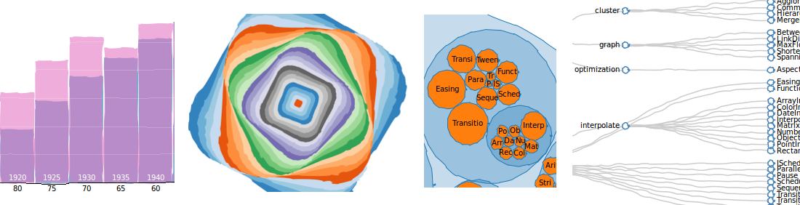

# comic.js

Javascript library that acts as plugin for Raphael.js, D3.js, SVG.js or as lib for the HTML5 Canvas, providing functions for cartoon style drawing.

In short it cartoonizes anything drawn with D3 with the single call `svg.magic()`. See examples [here](http://bl.ocks.org/balint42) and the full library with documentation [here](https://github.com/balint42/comic.js).

